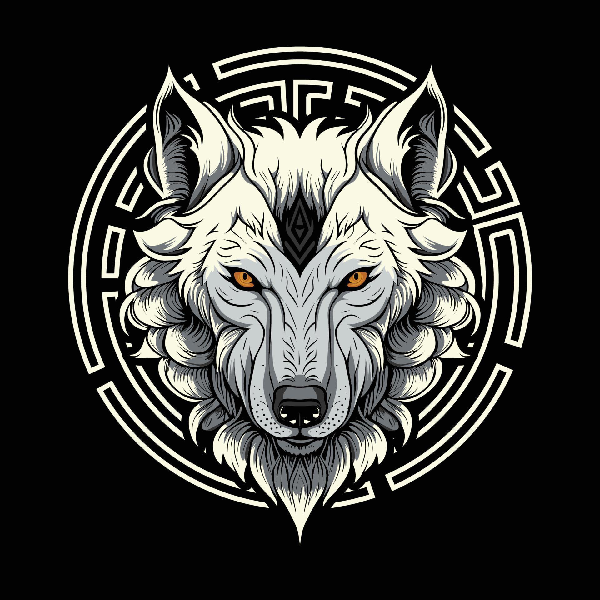

<div align="center">
  

  # 🌌 Manav Sharma | MERN Stack Developer & Backend Engineer

  An interactive, highly performant, and Awwwards-inspired developer portfolio built to showcase production-grade backend systems, full-stack projects, and system design expertise.

  [**Live Demo**](https://manav-sharma-portfolio.vercel.app) •
  [**LinkedIn**](https://www.linkedin.com/in/manav-sharma-4a167b274/) •
  [**NPM**](https://www.npmjs.com/~manavsharma3825)

</div>

<br />

## 🚀 About This Portfolio

This portfolio features a cinematic, dark-themed aesthetic with WebGL-powered 3D backgrounds, custom scroll logic, and butter-smooth text animations. The entire application is architected around providing a frictionless and deeply immersive user experience, running at a steady 60+ FPS even with complex 3D scenes.

### ✨ Key Features
- **High-Performance Animations:** Custom zero-lag letter-by-letter reveal engine using native CSS transitions, bypassing React render bottlenecks.
- **Immersive 3D/WebGL:** Dynamic WebGL rendering with interactive fluid simulations and parallax scrolling effects.
- **Cinematic Experience:** Meticulously crafted dark-mode aesthetic with neon accents, glassmorphism UI, and magnetic buttons.
- **Mobile First Performance:** Fully optimized across desktop, tablet, and mobile devices without sacrificing 3D fidelity.

---

## 💻 About Me

I'm a 4th-year ECE student at **NIT Bhopal** focused on **backend engineering** and **system design**. 
I have built and deployed multiple production-grade applications, including a self-hosted PaaS with a published npm CLI (1,076+ weekly downloads) and an adaptive HLS streaming platform. 

I am an active competitive programmer with **500+ LeetCode problems** solved and a **238-day streak**. Currently seeking SDE roles to build scalable, fault-tolerant systems that solve real-world problems.

---

## ⚡ Tech Stack

**Frontend & Animations:**
- React 19 + Vite
- Tailwind CSS v4
- Framer Motion & GSAP
- Lenis (Smooth Scroll)
- Three.js & React Three Fiber (R3F)

**My Backend Arsenal (Showcased in Projects):**
- Node.js & Express
- MongoDB & Redis
- BullMQ (Message Queuing & Background Workers)
- WebSockets (Socket.io)
- FFmpeg (Video Transcoding)
- Cloudflare R2 (S3-compatible CDN Storage)

---

## 🛠️ Installation & Setup

Want to run this locally? Follow these steps:

1. **Clone the repository:**
   ```bash
   git clone https://github.com/manavsharma111/portfolio.git
   cd portfolio
   ```

2. **Install dependencies:**
   ```bash
   npm install
   ```

3. **Run the development server:**
   ```bash
   npm run dev
   ```

4. **Open your browser:**
   Navigate to `http://localhost:5173`

---

## 📞 Connect with Me

If you'd like to chat about system design, backend architectures, or any potential opportunities, feel free to reach out!

- **Email:** [manavsharma3825@gmail.com](mailto:manavsharma3825@gmail.com)
- **LinkedIn:** [manav-sharma-4a167b274](https://www.linkedin.com/in/manav-sharma-4a167b274/)
- **GitHub:** [@manavsharma111](https://github.com/manavsharma111)

<br />

<div align="center">
  <i>Designed & Engineered by <b>Manav Sharma</b></i>
</div>
